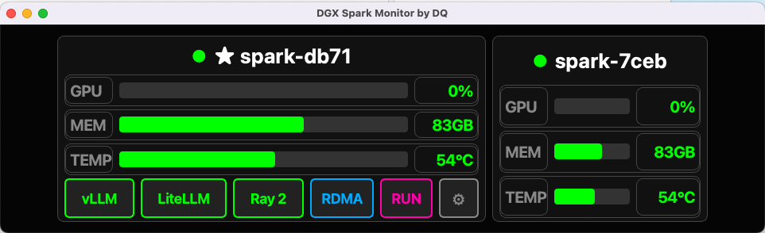
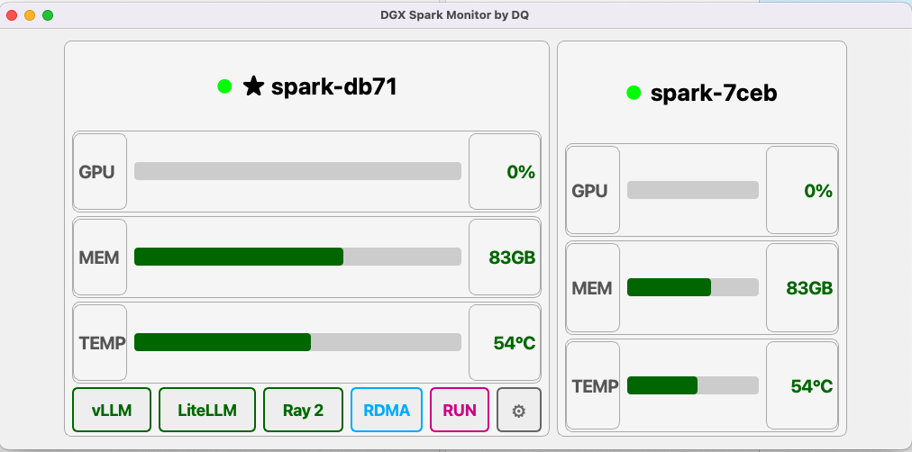
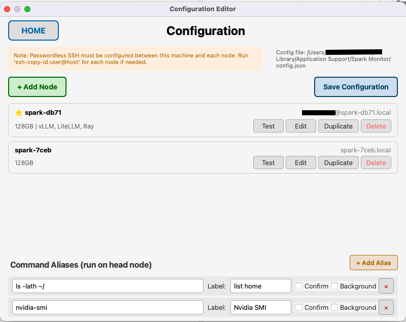
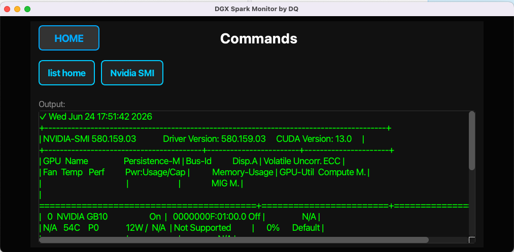
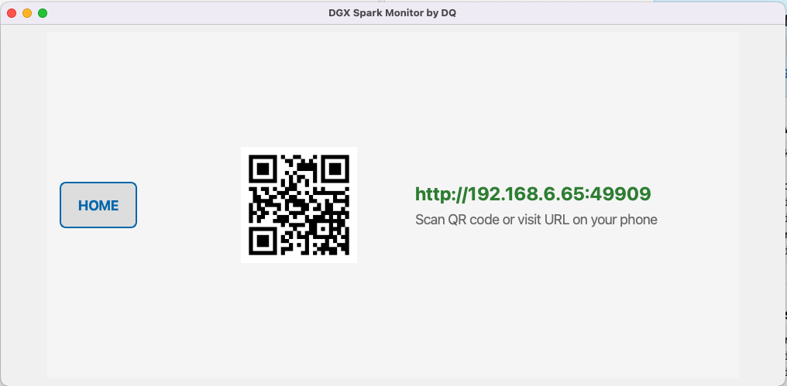
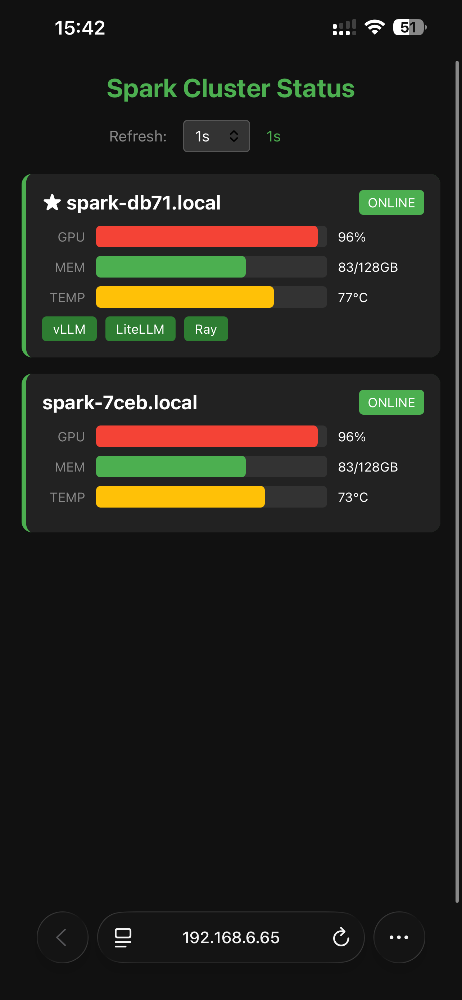

# DGX Spark Monitor by DevQuasar

[](https://devquasar.com)

A real-time monitoring dashboard for NVIDIA DGX Spark clusters. Monitor GPU utilization, memory usage, temperature, and service status across multiple nodes from a single interface.


## Features

- **Real-time Monitoring**: GPU usage, memory consumption, and temperature for each node
- **Service Status**: Monitor vLLM, LiteLLM, Ray, and other services at a glance
- **Multi-node Support**: Monitor multiple DGX Spark nodes from a single dashboard
- **Dark/Light Mode**: Switch between themes for different environments
- **Touch-friendly**: Optimized for 1U rack-mounted touchscreens (1424x280)
- **Remote Commands**: Execute predefined commands on cluster nodes via SSH
- **Mobile Web Access**: View cluster status from any device via built-in HTTP server
- **Screensaver & Sleep Mode**: Prevent burn-in on always-on displays

## Screenshots

### Desktop Application

| Dark Mode | Light Mode |
|-----------|------------|
|  |  |

### Configuration & Commands

| Configuration Editor | Commands View |
|---------------------|---------------|
|  |  |

### Mobile Web Access

Scan the QR code or visit the URL to monitor your cluster from any device on the network.

| QR Code Screen | Mobile View |
|----------------|-------------|
|  |  |

### 1U Rack Display

Perfect for mounting between your DGX Spark units in a server rack.

| Settings | Web Access QR |
|----------|---------------|
|  |  |

## Downloads

| Platform | Architecture | Download |
|----------|--------------|----------|
| macOS | Apple Silicon (M1/M2/M3) | [DGX-Spark-Monitor-1.0.0-arm64.dmg](../../releases/latest) |
| macOS | Intel | [DGX-Spark-Monitor-1.0.0-x86_64.dmg](../../releases/latest) |
| Linux | x86_64 | [dgx-spark-monitor-1.0.0-linux-x86_64.tar.gz](../../releases/latest) |
| Linux | ARM64 (OrangePi, RPi) | [dgx-spark-monitor-1.0.0-linux-aarch64.tar.gz](../../releases/latest) |

## Installation

### macOS

1. Download the DMG for your architecture (arm64 for Apple Silicon, x86_64 for Intel)
2. Open the DMG and drag "DGX Spark Monitor" to Applications
3. On first launch, right-click and select "Open" to bypass Gatekeeper

### Linux

```bash
# Extract the tarball
tar xzf dgx-spark-monitor-1.0.0-linux-x86_64.tar.gz

# Run the application
cd dgx-spark-monitor-1.0.0-linux-x86_64
./run.sh

# For fullscreen mode (recommended for rack displays)
./run.sh --fullscreen
```

## Configuration

On first launch, click the settings gear icon to configure your cluster nodes.

### Prerequisites

- **Passwordless SSH** must be configured between the monitoring machine and each DGX Spark node
- Run `ssh-copy-id user@node-hostname` for each node

### Adding Nodes

1. Click **+ Add Node** in the Configuration view
2. Enter the node hostname (e.g., `my-dgx-spark.local`)
3. Enter SSH credentials (username and hostname)
4. Specify GPU memory (128GB for DGX Spark)
5. Mark one node as "Head" for service monitoring
6. Click **Test** to verify SSH connectivity
7. Click **Save Configuration**

### Command Aliases

Define custom commands that can be executed on the head node:

1. Click **+ Add Alias** in the Configuration view
2. Enter the shell command (e.g., `nvidia-smi`)
3. Set a display label (e.g., "Nvidia SMI")
4. Enable "Confirm" for destructive commands
5. Enable "Background" for long-running commands

## Usage

### Main Dashboard

- **Green dot**: Node is online and responsive
- **Star icon**: Head node (runs cluster services)
- **GPU bar**: Current GPU utilization percentage
- **MEM bar**: GPU memory usage (unified memory on DGX Spark)
- **TEMP bar**: GPU temperature (green < 70°C, yellow < 85°C, red > 85°C)
- **Service buttons**: Click to view service logs (vLLM, LiteLLM, Ray)
- **RDMA**: View RDMA network status
- **RUN**: Execute predefined commands and aliases on head node

### Settings

- **Dark Mode**: Toggle dark/light theme
- **Screensaver**: Enable logo screensaver after timeout
- **Sleep**: Turn off display after extended idle time
- **Web Access**: Show QR code for mobile monitoring

### Keyboard Shortcuts

| Key | Action |
|-----|--------|
| `Q` / `Esc` | Quit application |
| `F` | Toggle fullscreen |
| `D` | Toggle dark mode |

## Hardware Setup (1U Rack Display)

For a dedicated rack-mounted display, we recommend:

- **Display**: GeeekPi 6.91" 1424x280 LCD Touch Screen
- **Controller**: OrangePi 5 Plus or Raspberry Pi 4/5
- **Mount**: 1U rack blank panel with cutout

### Autostart on Boot (Linux)

Create a systemd service or add to your desktop autostart:

```bash
# Example autostart script
cd /path/to/dgx-spark-monitor
./run.sh --fullscreen
```

## Requirements

- macOS 12+ (Monterey or later) or Linux with X11/Wayland
- Network access to DGX Spark nodes
- SSH key-based authentication configured

## License

This software is provided free of charge for personal and commercial use.

## Support

If you find this useful, consider buying me a coffee:

<a href='https://ko-fi.com/L4L416YX7C' target='_blank'></a>

## Author

Created by [DevQuasar](https://devquasar.com)
